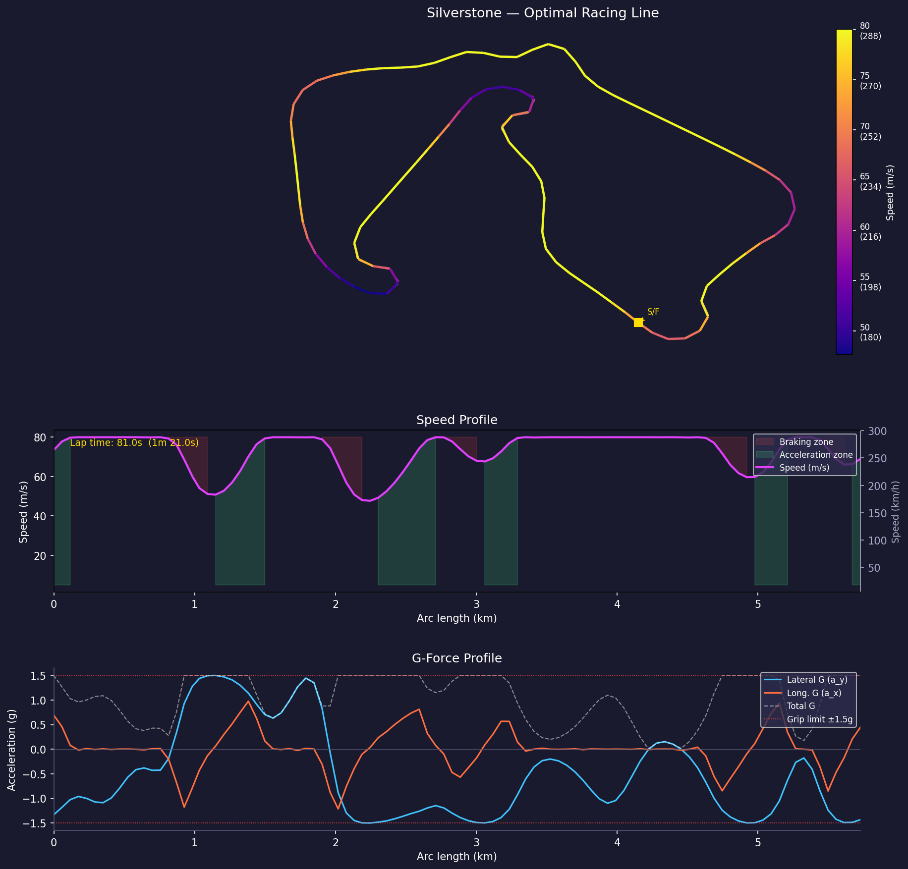

# Optimal Race Line

Finds the lap-time-minimizing path around Silverstone Circuit using a point-mass vehicle model and nonlinear optimal control.



---

## Method

The racing line problem is formulated as a continuous optimal control problem and transcribed into a finite-dimensional NLP using direct collocation.

**Track parameterisation** — the circuit is expressed in curvilinear coordinates $(s, n)$, where $s$ is arc length along the centerline and $n$ is signed lateral deviation from it. Track boundaries become simple scalar constraints $n_\min(s) \leq n(s) \leq n_\max(s)$ at each grid station.

**Vehicle model** — symmetric point mass with a friction circle constraint:

$$a_x^2 + a_y^2 \leq (\mu g)^2, \qquad \mu = 1.5$$

**Objective** — minimize total lap time:

$$\min J = \int_0^L \frac{ds}{v(s)}$$

**Transcription** — discretized at $N = 500$ arc-length stations with trapezoidal collocation, producing an NLP with 2,000 decision variables and ~2,500 constraints. Solved with SciPy's SLSQP. Warm-started from the kinematic speed envelope $v = \sqrt{\mu g / |\kappa(s)|}$.

---

## Files

| File | Purpose |
|---|---|
| `track.py` | Loads Silverstone geometry (FastF1 or hardcoded), computes arc length, curvature $\kappa(s)$, and boundary arrays $n_\min$, $n_\max$ |
| `vehicle.py` | Point-mass parameters, friction circle, kinematic speed limit |
| `optimize.py` | NLP formulation and SLSQP solver |
| `plot.py` | Track map (speed heatmap), speed profile, G-force profile |
| `export.py` | Runs the full pipeline and writes `website/data/solution.json` for the web visualisation |

---

## Usage

**Install dependencies:**
```bash
pip install numpy scipy matplotlib fastf1
```

**Run with hardcoded geometry:**
```python
# In plot.py __main__ block — uses built-in Silverstone waypoints
python plot.py
```

**Run with real FastF1 data:**

In `track.py`, follow the `## FASTF1 ##` comment blocks to swap in live session data:
```python
session = fastf1.get_session(2023, 'Silverstone', 'Q')
session.load(telemetry=True, weather=False, messages=False)
lap = session.laps.pick_fastest()
pos = lap.get_pos_data(extra_interpolate_edges=True)
_RAW = pos[['X', 'Y']].dropna().values / 10.0  # FastF1 uses decimetres
```

**Export data for the website:**
```bash
python export.py
```

---

## Vehicle Parameters

| Parameter | Value |
|---|---|
| Friction coefficient $\mu$ | 1.5 |
| Grip limit $\mu g$ | 14.7 m/s² |
| Max speed | 80 m/s (288 km/h) |
| Tire model | Symmetric friction circle |

---

## Dependencies

- `numpy` — array operations
- `scipy` — spline fitting (`splprep`, `splev`) and NLP solver (`minimize`, SLSQP)
- `matplotlib` — plotting
- `fastf1` — Silverstone track geometry (optional, required for real data)

---

## Notes

Track boundary widths in the hardcoded version are approximated from centerline curvature rather than real kerb data. Substituting real inner/outer boundary coordinates from FastF1 or OpenStreetMap will produce a more physically accurate racing line. See `track.py` for the relevant swap points.
